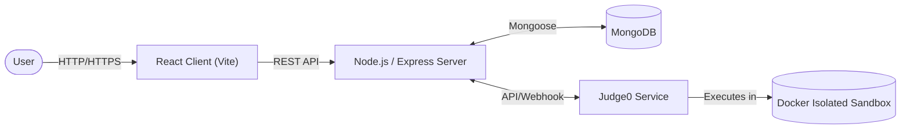

<div align="center">
  <br />
    
  <br />

  <h1>KodeX</h1>
  
  <p align="center">
    <strong>A comprehensive, high-performance online coding and competitive programming platform.</strong>
  </p>

  <p align="center">
    <a href="https://react.dev/"></a>
    <a href="https://nodejs.org/"></a>
    <a href="https://www.mongodb.com/"></a>
    <a href="https://judge0.com/"></a>
    <a href="LICENSE"></a>
  </p>
</div>

<hr />

## 📖 Table of Contents
- [About the Project](#-about-the-project)
- [System Architecture](#-system-architecture)
- [Key Features](#-key-features)
- [Tech Stack](#-tech-stack)
- [Getting Started](#-getting-started)
  - [Prerequisites](#prerequisites)
  - [Installation](#installation)
  - [Environment Variables](#environment-variables)
- [Project Structure](#-project-structure)
- [Contributing](#-contributing)
- [License](#-license)

## 🚀 About the Project

**KodeX** is a robust, full-stack web application designed to democratize programming by providing a seamless, interactive environment for writing, executing, and evaluating code. 

Built using the MERN stack (MongoDB, Express, React, Node.js) and deeply integrated with the **Judge0** execution engine, KodeX offers enterprise-grade code isolation, real-time feedback, and comprehensive analytics. Whether you are a coding enthusiast practicing algorithms, a learner taking their first steps, or an educator designing assessments, KodeX is built to scale and perform.

## 🏗️ System Architecture

KodeX is designed with a decoupled architecture, ensuring scalability, security, and performance.



## ✨ Key Features

*   **Integrated Code Editor**: A feature-rich, deeply customizable in-browser code editor powered by Monaco Editor (the same core engine that powers VS Code). Features syntax highlighting, auto-completion, and multi-language support.
*   **Secure Code Execution Sandbox**: Utilizes **Judge0** natively for isolated, secure, and highly reliable code compilation and execution across dozens of programming languages.
*   **Advanced Authentication**: Enterprise-grade security featuring JWT-based authentication coupled with Firebase integration for robust identity management.
*   **Interactive Analytics Dashboard**: Beautiful, data-rich visual representations of user progress, submission histories, and accuracy metrics powered by Recharts.
*   **Real-time Leaderboard**: A dynamic, highly-optimized ranking system allowing users to measure their performance against peers globally based on sophisticated scoring algorithms.
*   **Modern Workspace**: A fluid, responsive user interface engineered with Vite, React, and Tailwind CSS 4, offering deep dark mode integration and seamless user-flows.

## 🛠️ Tech Stack

<details>
<summary><strong>Frontend Architecture</strong></summary>

*   **Core**: React 19, Vite (for blazing fast HMR and builds)
*   **State Management**: Redux Toolkit, Redux Persist
*   **Styling & UI**: Tailwind CSS 4, React Icons
*   **Editor Environment**: Monaco Editor (`@monaco-editor/react`)
*   **Routing**: React Router 7
*   **Form Management**: React Hook Form with Zod validation schemas
*   **Data Visualization**: Recharts
*   **Network & Utilities**: Axios, React Toastify, Firebase

</details>

<details>
<summary><strong>Backend Architecture</strong></summary>

*   **Runtime & Framework**: Node.js, Express.js
*   **Database ORM**: Mongoose + MongoDB
*   **Authentication**: JSON Web Tokens (JWT), bcryptjs
*   **Security Middlewares**: Helmet, Express Rate Limit, Express Mongo Sanitize, HPP (HTTP Parameter Pollution prevention)
*   **Communications**: Nodemailer (Email services)

</details>

<details>
<summary><strong>Infrastructure & Execution Engine</strong></summary>

*   **Execution Backend**: [Judge0](https://judge0.com/)
*   **Containerization**: Docker & Docker Compose (Configurations residing in `infrastructure/judge0`)

</details>

## 🏁 Getting Started

To get a local copy up and running, follow these simple steps.

### Prerequisites

Ensure your development environment meets the following requirements:
*   **Node.js**: v18.0.0 or higher
*   **MongoDB**: Local instance running, or a MongoDB Atlas connection string
*   **Docker & Docker Compose**: Required for running the local Judge0 execution environment
*   **Git**: For version control

### Installation

1.  **Clone the repository**
    ```bash
    git clone https://github.com/Jeet0105/KodeX.git
    cd KodeX
    ```

2.  **Initialize the Backend**
    ```bash
    cd server
    npm install
    ```

3.  **Initialize the Frontend**
    ```bash
    cd ../client
    npm install
    ```

4.  **Spin up the infrastructure (Judge0)**
    Navigate to the infrastructure directory and start the Docker containers:
    ```bash
    cd ../infrastructure/judge0
    docker-compose up -d
    ```

### Environment Variables

You must create `.env` files in both the client and server directories.

**Backend (`server/.env`)**
```env
PORT=5000
NODE_ENV=development
MONGO_URI=your_mongodb_connection_string
JWT_SECRET=your_super_secret_jwt_key
JUDGE0_URL=http://localhost:2358 # Default local Judge0 instance
```

**Frontend (`client/.env`)**
```env
VITE_API_BASE_URL=http://localhost:5000/api/v1
VITE_FIREBASE_API_KEY=your_firebase_key
VITE_FIREBASE_PROJECT_ID=your_firebase_project_id
```

### Running the Application

To run the application locally, you'll need to start both the client and server development servers.

**Terminal 1 (Backend)**
```bash
cd server
npm run dev
```

**Terminal 2 (Frontend)**
```bash
cd client
npm run dev
```

The application will be available at `http://localhost:3000` (or whichever port Vite assigns) and the server will listen on `localhost:5000`.

## 📂 Project Structure

```text
KodeX/
├── client/                 # React frontend application
│   ├── src/                # Source code (Components, Pages, Redux slices)
│   ├── public/             # Static assets
│   └── package.json        # Frontend dependencies
├── server/                 # Express.js backend application
│   ├── controllers/        # Business logic
│   ├── models/             # Mongoose schemas
│   ├── routes/             # API endpoint definitions
│   └── middlewares/        # Custom Express middlewares
├── infrastructure/         # External services configuration
│   └── judge0/             # Docker configurations for Judge0
├── documentation/          # Development specifications (SRS, Proposals)
└── README.md               # You are here!
```

## 🤝 Contributing

Contributions are what make the open-source community such an amazing place to learn, inspire, and create. Any contributions you make are **greatly appreciated**.

1. Fork the Project
2. Create your Feature Branch (`git checkout -b feature/AmazingFeature`)
3. Commit your Changes (`git commit -m 'Add some AmazingFeature'`)
4. Push to the Branch (`git push origin feature/AmazingFeature`)
5. Open a Pull Request

## 📄 License

Distributed under the ISC License. See `LICENSE` for more information.

---
<div align="center">
  Built with ❤️ by the KodeX Team.
</div>
